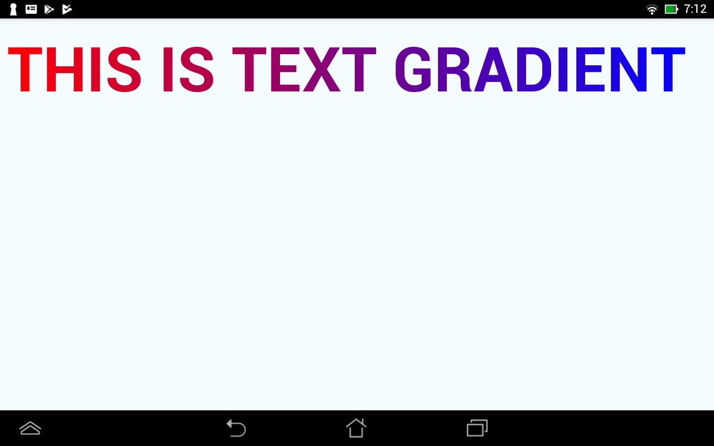
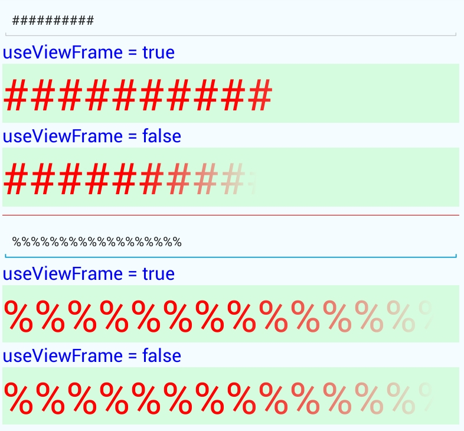

# react-native-text-gradient

[](https://badge.fury.io/js/react-native-text-gradient)
[](https://david-dm.org/iyegoroff/react-native-text-gradient)
[](src/index.d.ts)
[](https://www.npmjs.com/package/react-native-text-gradient)

React-Native text gradient component for iOS & Android.

## Getting started

`$ npm install react-native-text-gradient --save`

### Mostly automatic installation

`$ react-native link react-native-text-gradient`

### Manual installation

[link](manual_installation.md)

> If you are using Cocoapods you need to follow the manual installation guide.

## Status

- Component works as drop-in replacement for standard `Text` component and it is possible to have nested gradients.
- React-Native:
  - with rn >= 0.59.0 use latest version and [patch](#usage-with-rn--0560);
  - with rn >= 0.56.0 use 0.0.17 and [patch](#usage-with-rn--0560);
  - with rn >= 0.55.0 use 0.0.9;
  - with rn >= 0.54.0 use 0.0.7;
  - with rn >= 0.53.1 use 0.0.4;
  - rn 0.53.0 is not supported;
  - with rn >= 0.50.0 use 0.0.3.

## Example

```javascript
import { LinearTextGradient } from "react-native-text-gradient";

<LinearTextGradient
  style={{ fontWeight: "bold", fontSize: 72 }}
  locations={[0, 1]}
  colors={["red", "blue"]}
  start={{ x: 0, y: 0 }}
  end={{ x: 1, y: 0 }}
>
  THIS IS TEXT GRADIENT
</LinearTextGradient>;
```

|                        iOS                        |                        Android                         |
| :-----------------------------------------------: | :----------------------------------------------------: |
|  |  |

## Usage

### LinearTextGradient

Interface is similar to `Text` & [LinearGradient](https://github.com/react-native-community/react-native-linear-gradient)

#### colors

An array of at least two color values that represent gradient colors. Example: `['red', 'blue']` sets gradient from red to blue.

#### start

An optional object of the following type: `{ x: number, y: number }`. Coordinates declare the position that the gradient starts at, as a fraction of the overall size of the gradient, starting from the top left corner. Example: `{ x: 0.1, y: 0.1 }` means that the gradient will start 10% from the top and 10% from the left.

#### end

Same as start, but for the end of the gradient.

#### locations

An optional array of numbers defining the location of each gradient color stop, mapping to the color with the same index in `colors` prop. Example: `[0.1, 0.75, 1]` means that first color will take 0% - 10%, second color will take 10% - 75% and finally third color will occupy 75% - 100%.

#### useViewFrame

Optional. If true gradient will be calculated for text view background frame rather than text frame.

```javascript
<LinearTextGradient
  numberOfLines={1}
  useViewFrame={true}
  locations={[0.5, 0.95]}
  // note colors like '#FF000000' are used for seamless transition to transparent
  colors={["#FF0000", "#FF000000"]}
  start={{ x: 0, y: 0 }}
  end={{ x: 1, y: 0 }}
>
  %%%%%%%%%%%%%%%%%%%%%%
</LinearTextGradient>
```



## Usage with rn >= 0.56.0

Wait until https://github.com/facebook/react/pull/13211 will be merged or patch react-native to remove failing invariant checks

`$ node node_modules/react-native-text-gradient/patch-rn.js`

## Caveats

When mixing several text gradients and `Text`s top component always should be text gradient.

```javascript
<LinearTextGradient {...someGradientProps}>
  <Text>123</Text>
  qwerty
  <LinearTextGradient {...anotherGradientProps}>321</LinearTextGradient>
</LinearTextGradient>
```

This is necessary because only top text component is 'mapped' to actual native node and its children are 'virtual' from the native perspective.
